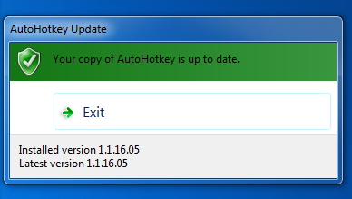
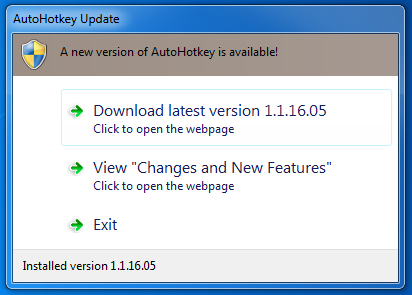

AutoHotkey_Updater
=======
 A very simple AutoHotkey script that uses task dialogs to determine if AutoHotkey is up to date - using TaskDialog by TheGood 
These scripts are built using [AutoHotkey](http://ahkscript.org/)

[AutoHotkey_Updater](AutoHotkey_Updater.ahk) 
  
=> Uses TaskDialogs to check if AutoHotkey is up to date 
=> Built with AutoHotkey 1.1.16.05 running on Windows 7 64bit 
=> Requires [TaskDialog](TaskDialog.ahk) from TheGood to be in the same directory to compile 
